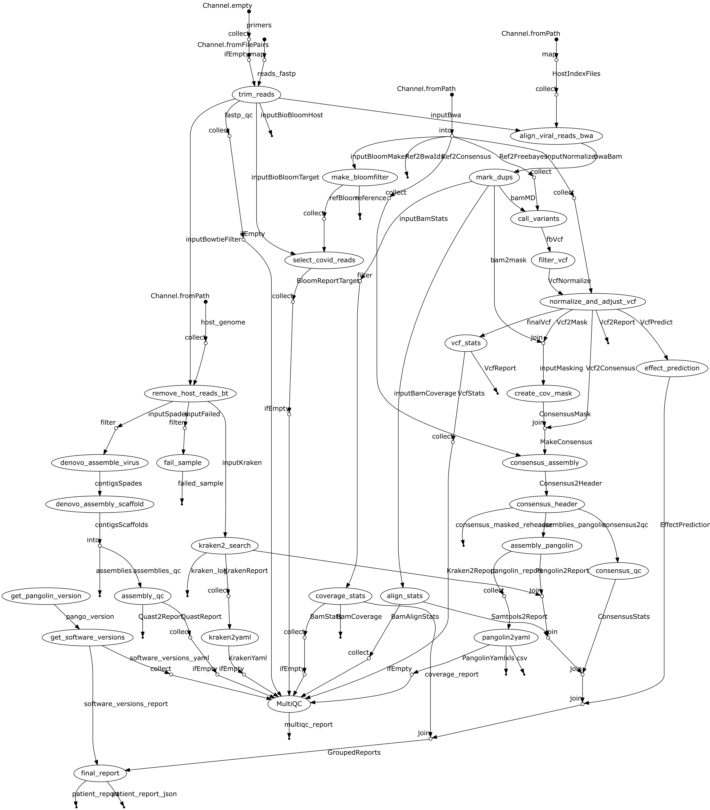

# Pipeline overview

This pipeline processes short read data from the Illumina platform to trim, align and/or assemble Sars-CoV2 raw data into de-novo assemblies on the one hand, and variant calls against the RefSeq reference genome on the other. Assembled genomes will be
lineage-typed using Pangolin. 

The output includes:

* Cleaned reads with leading/trailing bases removed to account for fragmented amplicon primers (e.g. ARTIC or Eden). 
* Taxonomic assignment of reads against a viral database to check for Sars-CoV2 (Kraken2)
* De-novo assembly of reads NOT mapping to human using Spades 3.15 and the included coronaspades.py worklfow. 
* Alignment of reads against the reference genome from RefSeq (NC_045512.2) using Bowtie2
** Marking of duplicate reads using Samtools
** Alignment statistics and coverage report
* Variant calling from aligned reads using Freebayes
* Filtering of variant calls using a minimal set of parameters
* Effect prediction of filtered variants using SnpEff using the included database for NC_045512.2

Software used:

FastP v0.20.0 (https://github.com/OpenGene/fastp)
BioBloom v2.3.1 (https://github.com/bcgsc/biobloom/)
Bowtie2 v2.3.5.1 (https://github.com/BenLangmead/bowtie2)
Samtools v1.10 (http://www.htslib.org/doc/samtools.html)
Bcftools v1.10 (http://www.htslib.org/doc/bcftools.html)
HTSlib v1.10 (http://www.htslib.org)
MoSDepth v0.2.9 (https://github.com/brentp/mosdepth)
Freebayes v1.3.2 (https://github.com/freebayes/freebayes)
Pangolin v2.1.7  (https://github.com/cov-lineages/pangolin)

